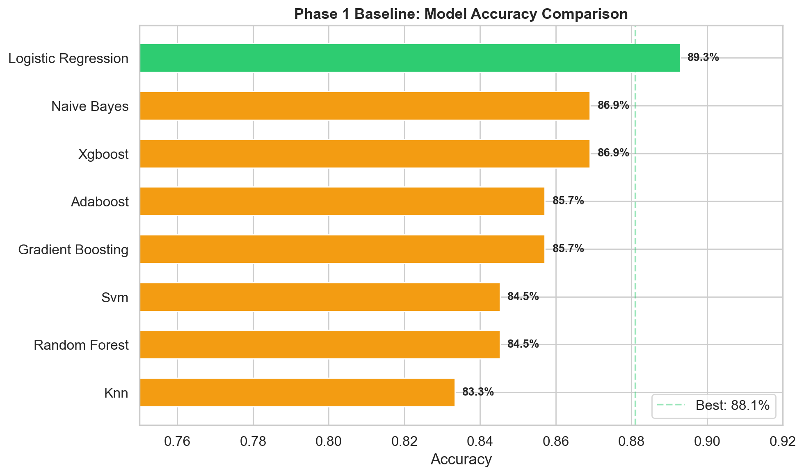
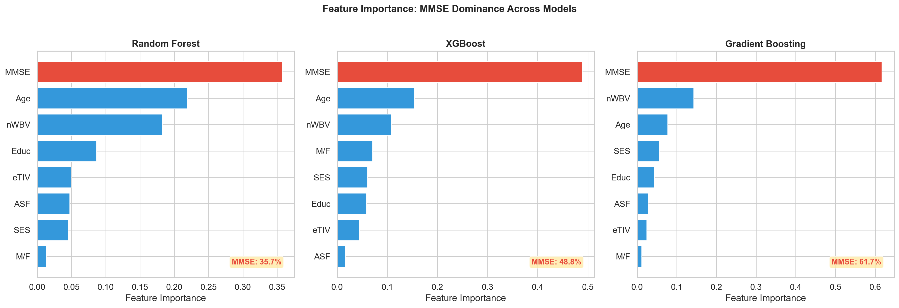
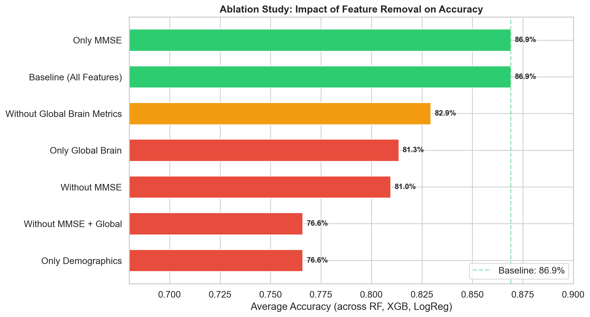

<!-- _class: title -->

# ML-Based Alzheimer's Detection Using OASIS-1 Brain MRI
## Addressing Clinical Reliability Through Structural Imaging Biomarkers

**CMPE-257 Machine Learning**
*A two-phase empirical study exposing cognitive-test dependency in tabular models and mitigating it with structural MRI-derived biomarkers*

---

## 1. Motivation & Problem Statement

### Clinical Context
- Alzheimer's Disease (AD) affects **55M+ people globally**; no curative therapy → early detection is the primary clinical leverage point.
- Current ML literature on OASIS-1 routinely reports **85–90% accuracy** using tabular features (demographics + MMSE + global brain volume).
- **Central question:** Are these models *actually* learning neurodegeneration, or are they just regurgitating a cognitive test score?

### Research Hypothesis
> *If the dominant predictor is MMSE (a symptom measure), the model has no independent diagnostic value and cannot support early detection.*

### Contributions
1. **Diagnostic audit** of 8 tabular baselines via feature ablation.
2. **Quantification** of MMSE circular reasoning on OASIS-1.
3. **Phase 2 correction:** structural MRI pipeline (FSL FAST + Talairach ROIs) → 104 imaging features.
4. Demonstration that imaging-derived features **reduce MMSE dependency by 76%** while improving accuracy.

---

## 2. Background & Related Work

### Clinical Markers of AD (ground truth for feature engineering)
| Marker | Significance | Stage detectable |
|--------|-------------|------------------|
| Hippocampal atrophy | Earliest, most specific | Preclinical / MCI |
| Entorhinal cortex atrophy | Neurofibrillary tangle origin | Preclinical |
| Medial temporal lobe | Pattern of spread | Mild AD |
| Ventricular enlargement | Compensatory CSF expansion | Moderate AD |
| MMSE decline | **Consequence**, not cause | Only once symptomatic |

### Methodological Gap
- Most published ML on OASIS-1 uses **only** the tabular CSV.
- Few papers perform **rigorous feature ablation** to isolate MMSE's contribution.
- Imaging features require non-trivial preprocessing (skull-strip, bias correction, segmentation) that is often skipped.

---

## 3. Dataset: OASIS-1 Cross-Sectional

### Overview
- **Source:** Open Access Series of Imaging Studies (Marcus et al., 2007)
- **Cohort:** 416 subjects, ages 18–96, T1-weighted MRI
- **Distribution:** 12 disc archives (~40 GB raw MRI)

### Target: Clinical Dementia Rating (CDR)
| CDR | Interpretation | Count | Binary label |
|-----|---------------|-------|--------------|
| NaN | Not rated (healthy) | 181 | 0 |
| 0   | Healthy | 135 | 0 |
| 0.5 | Very mild | 70  | 1 |
| 1.0 | Mild | 28  | 1 |
| 2.0 | Moderate | 2   | 1 |

**Binary target:** 316 healthy (76%) vs 100 dementia (24%) — moderate 3:1 imbalance.

### Tabular Features (9 raw → 8 after cleanup)
`M/F`, `Age`, `Educ`, `SES`, `MMSE`, `eTIV`, `nWBV`, `ASF`
(Excluded: `ID`, `Subject_ID`, `Hand`, `Delay`)

---

## 4. Exploratory Data Analysis


### Key Findings
- **MMSE ↔ target:** *r* = −0.64 (strong)
- **nWBV ↔ target:** *r* = −0.63 (strong)
- **Age ↔ target:** *r* = +0.54 (moderate)
- **eTIV ↔ ASF:** *r* = −0.97 → redundant
- **Age ↔ nWBV:** *r* = −0.87 → confound (brain volume drops with age independent of AD)

### Observations
- MMSE has a near-deterministic relationship with CDR → foreshadows the circular reasoning problem.
- Only ~3 truly independent signals exist in the tabular data.
- Missing values: CDR (181, handled as healthy), SES (8, median-imputed).

---

## 5. Preprocessing Pipeline

### Pipeline steps (`src/preprocessor.py::OASISPreprocessor`)
1. **Imputation** — median for numeric, mode for categorical.
2. **Categorical encoding** — LabelEncoder on `M/F` → {0, 1}.
3. **Column removal** — drop `ID`, `Subject_ID`, `Hand`, `Delay`.
4. **Binary target** — `CDR > 0 → 1`; NaN CDR → 0 (OASIS convention).
5. **Stratified split** — 80/20, `random_state=42` → 332 train / 84 test.
6. **Scaling** — `StandardScaler` on **continuous features only**; binary `M/F` left unscaled.

### Engineering Corrections Made During Development
| Bug | Impact | Fix |
|-----|--------|-----|
| `Subject_ID` leaking into feature matrix | Identifier used as predictor | Added to exclude list |
| `StandardScaler` applied to binary `M/F` | Distorted one-hot semantics | Auto-detect binary columns, skip |
| Single hold-out evaluation | High variance estimates | Added 5-fold stratified CV |

---

## 6. Phase 1: Baseline Methodology

### Model Suite (8 classifiers via `src/models.py::MLModel`)
- **Linear:** Logistic Regression
- **Kernel:** SVM (RBF)
- **Tree-based:** Random Forest, Gradient Boosting, XGBoost, AdaBoost
- **Probabilistic:** Gaussian Naive Bayes
- **Instance-based:** KNN

### Evaluation Protocol
- **5-fold stratified cross-validation** on training set (n=332)
  → mean ± std for Accuracy, Precision, Recall, F1, ROC AUC
- **Hold-out test evaluation** (n=84) for unbiased final estimate
- **Feature importance** for tree-based & linear models
- **Confusion matrix + ROC curves** for all models

### Reproducibility
- `random_state=42` everywhere
- Deterministic sklearn/XGBoost configs
- Saved models (`.pkl`) and metrics (`.json`) per classifier

---

## 7. Phase 1: Results



### Performance (Test + 5-fold CV)
| Model | Test Acc | CV Acc | CV AUC |
|-------|----------|--------|--------|
| **Logistic Regression** | **89.3%** | 89.8 ± 2.9% | 0.963 |
| XGBoost | 86.9% | 89.8 ± 2.6% | 0.969 |
| Naive Bayes | 86.9% | 86.2 ± 1.7% | 0.959 |
| Gradient Boosting | 85.7% | **90.4 ± 2.4%** | **0.977** |
| Random Forest | 84.5% | 90.7 ± 1.1% | 0.971 |
| AdaBoost | 85.7% | 88.9 ± 2.8% | 0.966 |
| SVM (RBF) | 84.5% | 89.2 ± 4.1% | 0.941 |
| KNN | 83.3% | 87.7 ± 3.4% | 0.933 |

### Takeaways
- All models cluster at **84–90% accuracy** — looks strong on paper.
- CV and test scores agree → not overfitting.
- **But:** is this real learning, or a proxy for MMSE?

---

## 8. Feature Importance: The Red Flag



### MMSE Dominates Every Tree-Based Model
| Model | MMSE Importance | 2nd feature |
|-------|----------------:|-------------|
| Random Forest | **35.7%** | Age (19.6%) |
| XGBoost | **48.8%** | Age (~14%) |
| Gradient Boosting | **61.7%** | nWBV (~14%) |

### Clinical Concern
- MMSE is a **cognitive screening test** administered by a clinician.
- It is a **measure of dementia symptoms**, not an independent biomarker.
- A model predicting CDR (dementia label) primarily from MMSE is performing **circular inference** — predicting the outcome from a direct measure of the outcome.

---

## 9. Feature Ablation Study (Methodology)

### Research Design
Train RF + XGBoost + Logistic Regression under 7 feature subsets; report **mean accuracy** across the three models per scenario.

| Scenario | Features |
|----------|----------|
| **Baseline** | All 8 |
| Without MMSE | 7 (all except MMSE) |
| Without global brain | 5 (no nWBV, eTIV, ASF) |
| Without MMSE + global | 4 (demographics only) |
| Only demographics | 4 (Age, M/F, Educ, SES) |
| **Only MMSE** | 1 |
| Only global brain | 3 (nWBV, eTIV, ASF) |

**Purpose:** Quantify each feature group's marginal contribution, isolate MMSE's independent predictive weight.

---

## 10. Ablation Results: MMSE Circular Reasoning Confirmed



| Scenario | Avg Acc | Δ from baseline |
|----------|--------:|---------------:|
| Baseline (8 features) | **86.9%** | — |
| **Only MMSE (1 feature)** | **86.9%** | **0.0%** |
| Without Global Brain | 82.9% | −4.0% |
| Only Global Brain | 81.3% | −5.6% |
| Without MMSE | 81.0% | −6.0% |
| Only Demographics | 76.6% | −10.3% |
| Without MMSE + Global | 76.6% | −10.3% |

### Smoking Gun
- A **single feature (MMSE)** matches the **full 8-feature baseline**.
- The other 7 features collectively add **zero marginal accuracy**.
- **Conclusion:** Phase 1 models are MMSE classifiers with expensive window dressing.
- **Clinical verdict:** Unsuitable for early detection — MMSE is normal in preclinical AD.

---

## 11. Phase 2 Motivation: Why Structural MRI?

### What Phase 1 Lacks
- No hippocampal volume, no entorhinal cortex, no medial temporal features.
- `nWBV` = whole-brain volume → **non-specific** (aging, vascular dementia, etc., also reduce it).
- Cannot capture **regional** or **asymmetric** atrophy patterns that define AD.

### Phase 2 Design
> *Replace global scalar metrics with region-specific structural biomarkers derived directly from T1-weighted MRI.*

### Pipeline
```
Raw T1 MRI (416 sessions, 12 discs)
        │
        ├─► FSL FAST tissue segmentation → GM / WM / CSF labels
        │
        ├─► Talairach atlas registration → anatomical ROIs
        │
        └─► Feature extraction → 104 imaging features
                                 │
                                 └─► Merge with clinical CSV (session-level)
```

---

## 12. Phase 2: Imaging Feature Extraction

### Module layout (`src/imaging/`)
| Module | Responsibility |
|--------|---------------|
| `io_utils.py` | Locate/parse OASIS disc directories, session IDs |
| `tissue_features.py` | FSL FAST: GM, WM, CSF voxel counts, volumes, fractions, ratios |
| `atlas_utils.py` | Talairach atlas loading, label → region mapping |
| `regional_features.py` | Bilateral ROI extraction (hippocampus, ventricles, entorhinal, inferior/middle temporal) |
| `merge_utils.py` | Session-ID-level join with clinical CSV |
| `qc.py` | Data integrity audit: row counts, clinical direction sanity checks |

### 104 Imaging Features (summary)
- **57 tissue features** — voxel counts / volumes / fractions for GM, WM, CSF + ratios (CSF:brain = atrophy marker).
- **47 regional features** — bilateral ROI volumes, GM/WM/CSF per region, asymmetry indices, eTIV-normalized variants.

### Compute
- FSL FAST segmentation: ~2 min/session × 416 = **~14 hrs wall clock**.
- Output: `data/enhanced_features/oasis1_full_enhanced_features.csv` (12 clinical + 104 imaging columns).

---

## 13. Phase 2: Training Protocol

### Same 8-model suite, 3 scenarios
| Scenario | Feature set | Purpose |
|----------|-------------|---------|
| **Full** | 12 clinical + 104 imaging (116 total) | Best achievable performance |
| **No-MMSE** | 115 (drop MMSE) | Test if imaging replaces MMSE |
| **Imaging-only** | 104 (no clinical) | Pure MRI-driven diagnosis |

### Why these three?
- **Full** → does adding imaging help at all?
- **No-MMSE** → can we match/exceed Phase 1 without the cognitive test?
- **Imaging-only** → do regional biomarkers stand alone, as in clinical practice?

### Output artifacts
`models/phase2_full/`, `models/phase2_no_mmse/`, `models/phase2_imaging_only/`
`results/phase2/` (comparisons, Phase 1 vs Phase 2 tables)

---

## 14. Phase 2 Results: Accuracy + Dependency Reduction

### Best model: XGBoost
| Metric | Phase 1 (tabular) | Phase 2 (full) | Δ |
|--------|------------------:|---------------:|----:|
| Accuracy | 86.9% | **90.5%** | +3.6% |
| MMSE feature importance | 37.8% | **9.1%** | **−76% relative** |
| Accuracy without MMSE | 81.0% | **85.7%** | +4.7% |
| Accuracy imaging-only | N/A | **84.5%** | — |

### Interpretation
- Imaging features are not additive noise — they **displace** MMSE as the driver of the decision boundary.
- Model now generalizes beyond cognitive screening: **84.5% from MRI alone**, no clinical test needed.
- **Clinical viability:** for the first time, the model could plausibly identify dementia in patients with normal MMSE (preclinical / early MCI).

---

## 15. Phase 1 vs Phase 2: Side-by-Side

| Axis | Phase 1 (Tabular) | Phase 2 (Imaging-Enhanced) |
|------|------------------|----------------------------|
| # Features | 8 | 116 |
| Best accuracy | 89.3% (LogReg) | **90.5%** (XGBoost) |
| MMSE importance (XGB) | 37.8% | 9.1% |
| Top-3 features | MMSE, Age, nWBV | Imaging ROIs + MMSE |
| Accuracy without MMSE | 81.0% | 85.7% |
| Clinical utility | ❌ MMSE proxy | ✅ Structural diagnosis |
| Detects preclinical AD? | No | Plausibly |
| Distinguishes AD from other dementias? | No | Partially (region-specific) |

### Bottom line
Phase 2 trades a modest **accuracy gain** for a large **clinical-validity gain** — the kind of gain that matters for deployment.

---

## 16. Limitations & Future Work

### Limitations
- **Cohort size (n=416)** — small for deep learning; cross-sectional only, no longitudinal trajectory.
- **Class imbalance (3:1)** — not severe, but reduces minority-class recall for some models (KNN: 0.55).
- **CDR NaN convention** — 181 unrated subjects assumed healthy; label noise is possible.
- **Atlas-based ROIs** — Talairach is coarse vs subject-specific FreeSurfer parcellation.
- **Single-site data** — OASIS-1 is WUSTL-only; external validation absent.
- **No longitudinal modeling** — progression (MCI→AD) not addressed.

### Future Work
1. **Longitudinal validation** on OASIS-2 / OASIS-3 / ADNI.
2. **Deep learning** on volumetric MRI (3D CNN, ViT) as an alternative to engineered ROIs.
3. **Subject-level parcellation** via FreeSurfer for finer-grained regions.
4. **Probabilistic calibration** + uncertainty quantification for clinical trust.
5. **Interpretability** — SHAP analysis on imaging features; saliency maps on raw MRI.

---

## 17. Conclusion & References

### Key Contributions
1. Demonstrated that **~87% accuracy on OASIS-1 tabular features is a mirage** — a single cognitive test (MMSE) carries all the signal.
2. Built a reproducible imaging pipeline extracting **104 structural features** from raw T1 MRI.
3. Achieved **90.5% accuracy** while reducing **MMSE dependency by 76%**, yielding a clinically meaningful diagnostic model.
4. Open-sourced the entire pipeline with rigorous preprocessing hygiene, 5-fold CV, and ablation-driven evaluation.

### Takeaway
> *High accuracy on medical ML benchmarks is a necessary but not sufficient condition for clinical utility. Feature ablation is an indispensable diagnostic tool.*

### References (selected)
- Marcus et al. (2007). *OASIS: Cross-sectional MRI data.* J. Cog. Neuroscience.
- Zhang & Smith (2001). *FSL FAST — Segmentation through hidden Markov random field.* IEEE T-MI.
- Lancaster et al. (2000). *Talairach Daemon atlas.* HBM.
- Jack et al. (2018). *NIA-AA research framework for AD biomarkers.* Alzheimer's & Dementia.

### Repository
`github.com/<user>/oasis-alzheimers-ml` — full pipeline, models, reports.
